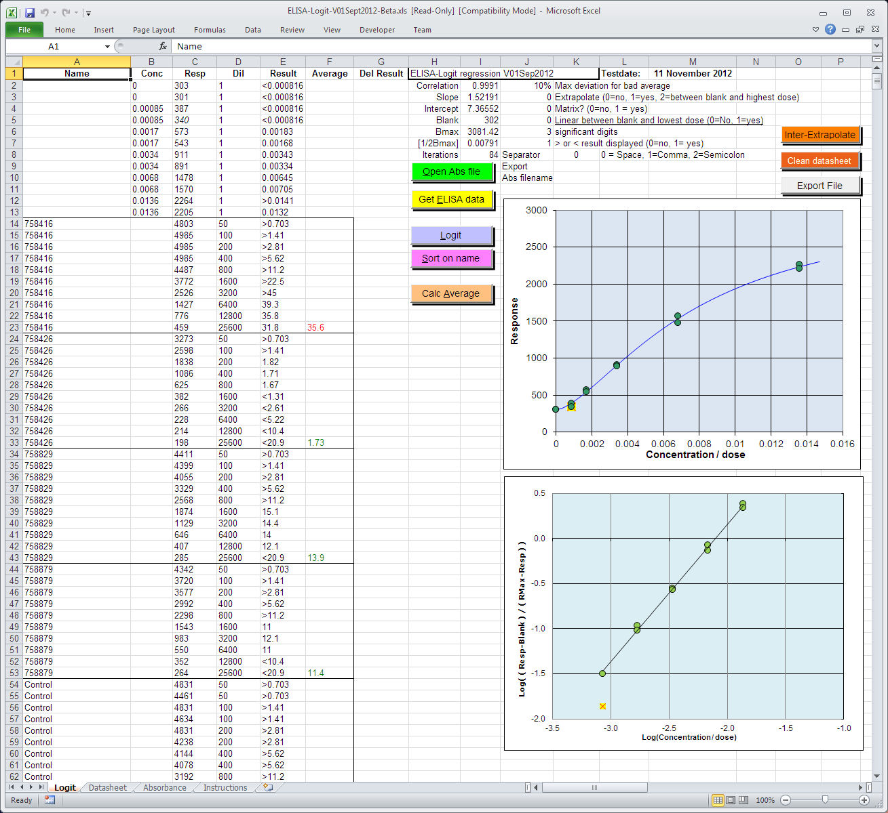

# ELISA logit regression in Excel

Logit regression in Excel is especially designed to calculated reults on a sigmoid calibration curve for  ELISA-tests and RIA's. 

The logit regression is suitable for calculating a sigmoidal (S-shaped) curve, up to an almost straight line, through data pairs. This form of calibration line occurs with dose-response curves that approach asymptotically to a maximum response.   
With the calculated parameters of the regression line, the response and the dilution of the unknown sample, the dose in a sample is calculated.   
An average dose is calculated for multiple measurements of the same sample. Parameters in the worksheet can be used to control the signaling of poor reproducibility of the average, extrapolation of the measurement area, significant digits and the creation of an export file.  
The program can easily incoperated in a LIMS with its import and export functionality.
See also here: https://ednieuw.home.xs4all.nl/Calibration/Logit/Logit.htm  

De logit-regressie is geschikt om een sigmoïdale (S-vormige) kromme, tot een nagenoeg rechte lijn, door kalibratiepunten te berekenen. Deze vorm van kalibratielijn komt voor bij dose-responscurven die asymptotisch naar een maximum respons naderen. Met de berekende regressielijn, de respons en de verdunning van het onbekende monster wordt de dosis of concentratie in het monster berekend.   
Bij meerdere metingen van hetzelfde monster wordt een gemiddelde berekend. Door middel van parameters in de worksheet kan de signalering van een slechte reproduceerbaarheid van het gemiddelde, extrapolatie van het meetgebied, significante cijfers en een exportfile gestuurd worden. 
Het programma is  geschikt om te worden gebruikt in combinatie met een LIMS door zijn aanwezige import en export functionaliteit.
Password eddie for the VBA can be found in the manual if you make the font colour black after "password: " 
